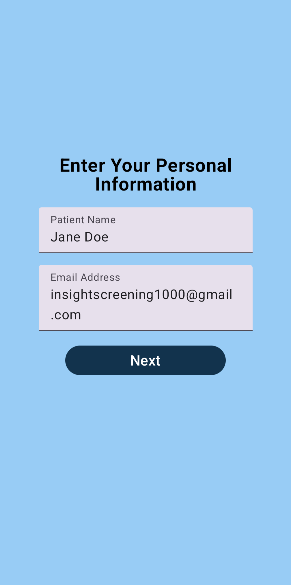
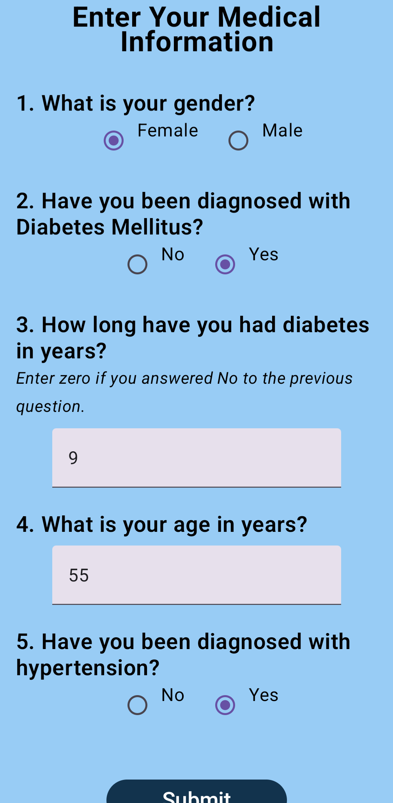
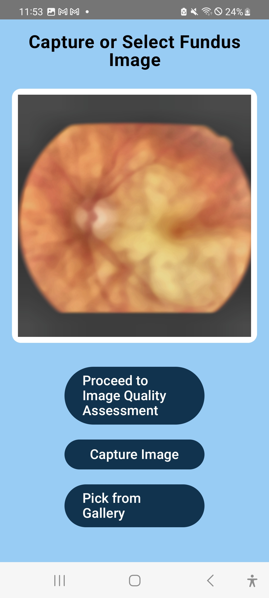
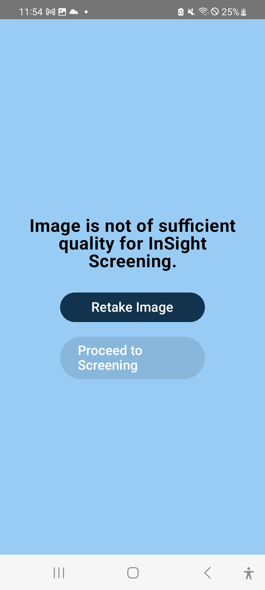
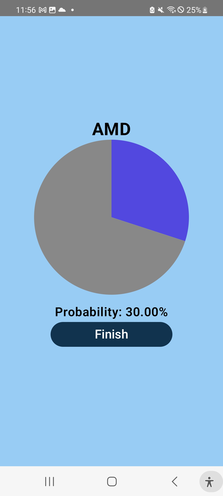
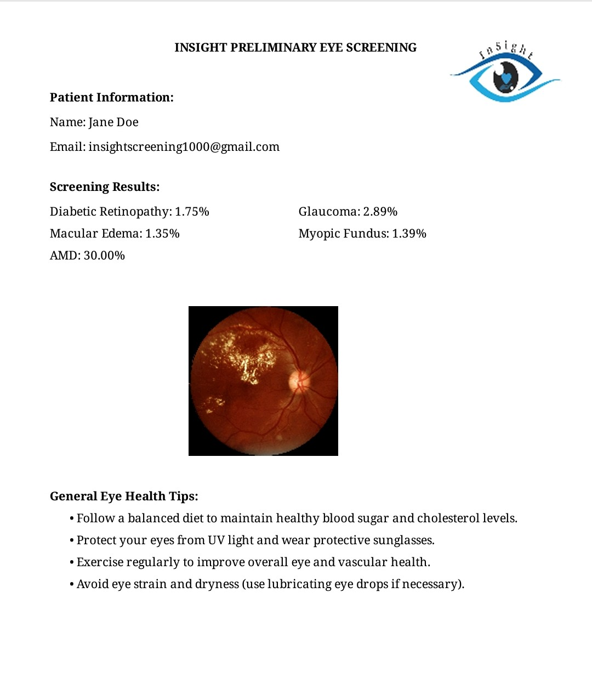

## InSight: AI-Powered Retinal Disease Screening App
InSight is an Android application for rapid mobile retinal disease screening using multimodal deep learning.

The app combines fundus image analysis with patient metadata to provide preliminary assessments for several common retinal conditions. All inference is done on-device, preserving user privacy and enabling offline use.

---

## Overview
InSight performs retinal disease assessment through:

- Fundus image classification
- Metadata-based risk adjustment (age, diabetes history, hypertension, disease duration)
- On-device PyTorch models
- Automated PDF report generation summarizing results

---

## App Flow

### 1. Home Screen
Users start by selecting "Get Started."

**Screenshot Placeholder:**  

---

### 2. Enter Personal Information
Users enter their name and email. This information is included in the final PDF report.

**Screenshot Placeholder:**  

---

### 3. Enter Medical Metadata
Users enter relevant metadata such as age, gender, diabetes history, hypertension status, and duration of diabetes.  
Age and diabetes-duration binning occur in `binAge()` and `binDbTime()`, located in `MetadataUtils.kt`.

**Screenshot Placeholder:**  

---

### 4. Capture or Select Fundus Image
The user can capture a fundus image with the device camera or select an existing image from the gallery.

**Screenshot Placeholder:**  

---

### 5. Image Quality Assessment
A blur-detection model evaluates whether the image is high enough in quality to be analyzed.  
If the image is too blurry, the user is prompted to retake it.  
If acceptable, the app proceeds to disease screening.

The quality check is implemented in `isImageHighQuality()` in `MainActivity.kt`.

**Screenshot Placeholder:**  

---

### 6. Disease Screening
The multimodal classifier estimates probabilities for:

- Diabetic Retinopathy  
- Glaucoma  
- Macular Edema  
- Myopic Fundus  
- Age-related Macular Degeneration  

A separate classifier provides Diabetic Retinopathy severity grading.

**Screenshot Placeholder:**  
`

---

### 7. PDF Report Generation
The app generates a detailed PDF report including:

- Patient information  
- Metadata summary  
- Fundus image  
- Condition probabilities  
- DR severity level  
- Interpretation and recommended next steps  

Users can save the PDF locally or email it to themselves.  
PDF generation is handled in `generatePDF()` in `MainActivity.kt`.

**Screenshot Placeholder:**  

---

The app loads three PyTorch models from the assets folder:

- `traced_metafusion_model3.pth` — primary multimodal classifier  
- `traced_metafusion_dr_model2.pth` — DR severity classifier  
- `traced_blur_detector2.pth` — image quality model  

Tensor creation, normalization, and inference logic are implemented in:

- `createTensorListFromBitmaps()`  
- `classifyImage()`  
- `classifyDR()`  
- `isImageHighQuality()`  

These are located in `MainActivity.kt`.
